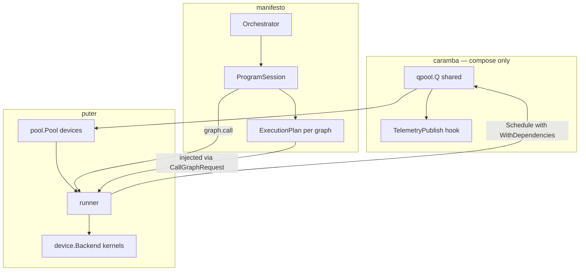

Here's where things stand and how I'd wire them for performance, with **qpool** as the shared execution and observability substrate.

## Current state

The shell is wired. Compile → session → executor works until the first `graph.call`, which hits the runner stub:

```29:43:/Users/theapemachine/go/src/github.com/theapemachine/puter/runner/runner.go
func (runner *Runner) CallGraph(
	ctx context.Context,
	request runtime.GraphCallRequest,
) (runtime.GraphCallResult, error) {
	_ = ctx
	_ = runner.devicePool
	// ...
	return runtime.GraphCallResult{}, fmt.Errorf(
		"runner: graph %q execution is not implemented",
		request.GraphName,
	)
}
```

Two other gaps block performance immediately:

- `root.go` passes **`nil`** into `pool.New` — CPU/Metal backends get no worker pool
- **No IR passes / ExecutionPlan** — fusion, placement, memory plan exist only in docs

---

## Target architecture



**Rule preserved:** manifesto never imports puter. It emits an opaque plan; runner interprets it and calls `device.Backend` methods directly.

---

## Where qpool belongs

| Layer | Role | qpool usage |
|-------|------|-------------|
| **caramba** | Single shared pool for the process | `NewQ(ctx, min, max, &Config{TelemetryPublish: …})` → `pool.New(ctx, q)` |
| **puter/device** | Intra-kernel / batch parallelism | Already holds `*qpool.Q`; needs non-nil pool |
| **puter/runner** | Inter-node graph parallelism | Schedule plan nodes with `WithDependencies` matching IR edges |
| **hf/hub** | Download progress | Already uses `qpool.Publish` — wire same `TelemetryPublish` sink |
| **manifesto/runtime** | Sequential program steps | No qpool import; stays sequential over `main:` |

qpool's dependency DAG maps cleanly onto `ir.Graph` topo: each node is a job, edges are `WithDependencies`. Independent branches run in parallel up to worker count; Metal/CUDA streams can still serialize within a device when the plan says so.

For latency-sensitive single-node paths (small graphs, host control ops), runner can use `ScheduleFast` for leaf work that doesn't need QSpace persistence — but graph nodes should use normal `Schedule` so telemetry and backpressure apply.

---

## ExecutionPlan contract (manifesto → puter boundary)

Define in **manifesto/runtime** (no puter import):

```go
type ExecutionPlan struct {
    GraphName string
    Nodes     []PlanNode      // topo order + deps
    Transfers []PlanTransfer  // explicit cross-device copies
    Weights   []PlanWeight    // safetensors path + bind metadata
}

type PlanNode struct {
    ID         string
    DeviceID   string          // from placement pass
    Op         string          // matches device.Backend method family
    Inputs     []PlanWire
    Outputs    []PlanWire
    Attributes map[string]any
    DependsOn  []string
}
```

`GraphCallRequest` grows to carry `Plan *ExecutionPlan` (or `Compute` stays `*ir.Graph` and runner builds plan on first call — but building in manifesto keeps puter dumb and testable).

Runner's job: walk/cache plan → for each ready node, bind tensors → call the typed `device.Backend` method → store outputs in a per-call workspace → `qpool.Schedule` with deps for parallel waves.

---

## Phased wiring (critical path first)

### Phase 0 — Compose qpool at the root (small, unblocks everything)

In `caramba/cmd/root.go`:

1. Create one `qpool.Q` from config (worker bounds, regulators, `TelemetryPublish`)
2. Pass it to `pool.New(ctx, q)` instead of `nil`
3. Optionally `qpool.Subscribe` in caramba for a debug TUI / structured log sink

This alone enables parallel CPU kernels and gives you job-level metrics via `MetricSnapshot()`.

### Phase 1 — Sequential `CallGraph` (prove the path)

Before fusion or placement, implement runner with:

1. Cast `request.Compute` → `*ir.Graph`
2. Topo-sort nodes
3. Run **sequentially** on `devicePool.DefaultDevice()` (or first discovered)
4. Map `ir.Node` op IDs → `device.Backend` calls (start with ops in chat: linear, embedding, attention, layernorm, sampling)
5. Bridge inputs: host slices → upload → kernel → download → outputs map

Goal: `runtime/chat.yml` completes one forward pass. No qpool graph parallelism yet — just correct kernels.

### Phase 2 — ExecutionPlan emission (manifesto/runtime)

Add `manifesto/runtime/plan.go`:

1. **Verify** — dtypes, shapes, op IDs known
2. **Placement** — consult injected `DeviceCatalog` (interface listing `[]DeviceID` from pool, passed at session creation)
3. **Memory plan** — tensor lifetime, reuse buffers where safe
4. Cache plan on `ProgramSession` keyed by graph name

Fusion catalog consultation can wait; start with 1:1 node → kernel.

### Phase 3 — Parallel runner via qpool

Runner executes plan waves:

- Wave = nodes whose deps are satisfied
- Each node: `q.Schedule(nodeID, fn, WithDependencies(deps))`
- `fn` resolves inputs from workspace, calls `device.Backend`, writes outputs
- `TelemetryPublish`: emit `graph-node-start/complete` events with graph name, node ID, device, latency

Regulators on the shared pool cap concurrent GPU work (e.g. `BackpressureRegulator` when `BusyWorkers == maxWorkers`).

### Phase 4 — Fusion + multi-device

1. manifesto IR pass reads **fusion patterns** via injected `FusionCatalog` interface (puter/fusion wrapped by caramba, passed to orchestrator — same pattern as Hub)
2. Fused super-nodes become single plan entries → single fused kernel dispatch where puter has them
3. Placement assigns nodes across `metal:0`, `host:0`, etc.; `PlanTransfer` edges trigger explicit copy/upload

### Phase 5 — Weights + diffusion loop

1. Runner loads SafeTensors once per graph (cache on session), uploads via `tensor.Backend`
2. Wire `storeSchedulerOutput` + `scheduler.delta` in executor for diffusion
3. Extend plan for denoiser loop (graph.call inside `control.loop_each` reuses cached plan)

---

## Telemetry / broadcasting

Use qpool at two levels:

**Process-level (caramba wires once):**

```go
cfg := &qpool.Config{
    TelemetryPublish: func(ev qpool.Event) {
        // fan-out: structured log, metrics backend, optional UI
    },
    Regulators: []qpool.Regulator{ /* backpressure for GPU */ },
}
```

Subscribe once for cross-cutting events (`hub/download`, `graph-node-complete`, `pool/scale-up`). hf/hub already publishes via `qpool.Publish` — unify under the same sink so download and compute share one stream.

**Graph-level (runner):**

Per `graph.call`, publish fields: `graph`, `node`, `device`, `bytes`, `latency_ns`. Enables live profiling without manifesto knowing about qpool.

Optional: `BroadcastGroup` for a future research UI subscribing to run progress — not needed for perf, useful for demos.

---

## What not to do

- Don't put graph execution logic in caramba beyond composition
- Don't add string registry dispatch in runner — call `device.Backend` methods from plan op descriptors
- Don't import puter from manifesto — inject `DeviceCatalog`, `FusionCatalog`, `runtime.Backend`
- Don't parallelize manifesto executor steps — programs are declarative sequential; parallelism lives inside `graph.call`

---

## Suggested next concrete step

**Phase 0 + Phase 1 together:** wire qpool in `root.go`, then implement sequential `CallGraph` for one graph (chat LLM forward). That gives you:

- Real kernel dispatch on Metal/CPU
- Non-nil qpool in device backends
- Telemetry from day one
- A test target: `caramba --program runtime/chat.yml`

After that, ExecutionPlan + qpool wave scheduling is the performance multiplier — independent attention heads, pipeline stages, and host/GPU overlap all come from the same dependency scheduler you already have in qpool.

Want me to start with Phase 0 (qpool wiring in `root.go` + config) or Phase 1 (`CallGraph` sequential implementation)?