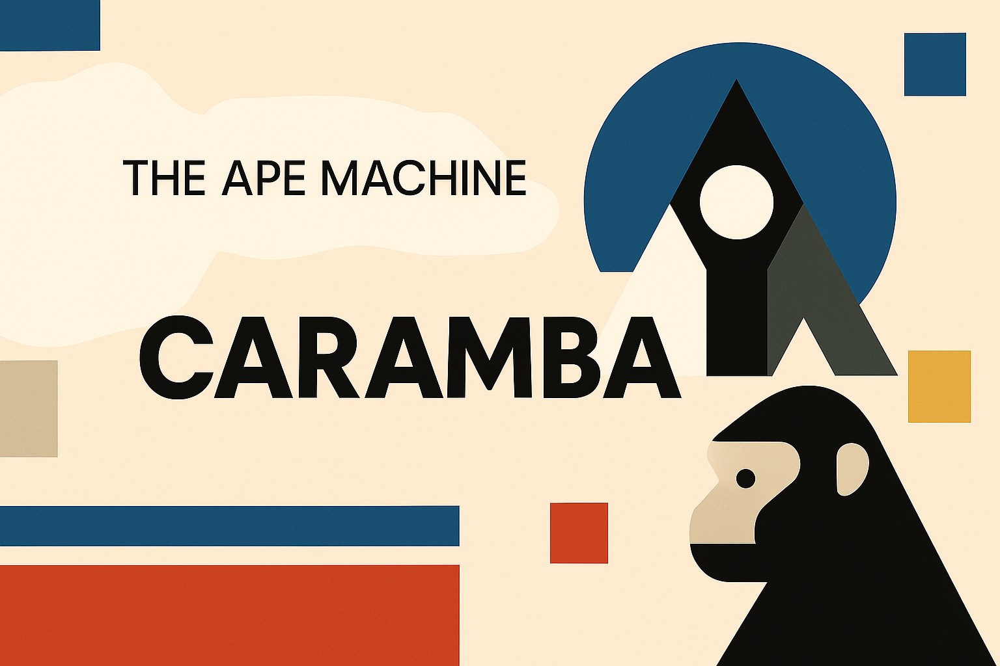

# 🔮 Caramba: AI Agent Framework

_Unleashing AI agent collaboration across ecosystems._

[](https://github.com/theapemachine/caramba/actions/workflows/main.yml)
[](https://goreportcard.com/report/github.com/theapemachine/caramba)
[](https://godoc.org/github.com/theapemachine/caramba)
[](https://opensource.org/licenses/MIT)
[](https://sonarcloud.io/summary/new_code?id=TheApeMachine_caramba)
[](https://sonarcloud.io/summary/new_code?id=TheApeMachine_caramba)
[](https://sonarcloud.io/summary/new_code?id=TheApeMachine_caramba)
[](https://sonarcloud.io/summary/new_code?id=TheApeMachine_caramba)
[](https://sonarcloud.io/summary/new_code?id=TheApeMachine_caramba)
[](https://sonarcloud.io/summary/new_code?id=TheApeMachine_caramba)
[](https://sonarcloud.io/summary/new_code?id=TheApeMachine_caramba)
[](https://sonarcloud.io/summary/new_code?id=TheApeMachine_caramba)
[](https://sonarcloud.io/summary/new_code?id=TheApeMachine_caramba)



Caramba is a Go-based framework designed for building sophisticated AI agent applications. It facilitates seamless communication and collaboration between AI agents by implementing key industry protocols like [Google's Agent-to-Agent (A2A)](https://google.github.io/A2A/#/) and [Anthropic's Model Context Protocol (MCP)](https://www.anthropic.com/news/model-context-protocol). This allows agents built with Caramba to interact effectively across different frameworks, vendors, and systems.

---

> **Warning**
> Caramba is under active development. While we strive for stability, APIs and internal components may change. Documentation might occasionally lag behind the latest code adjustments.

---

## �� Table of Contents

- [🔮 Caramba: AI Agent Framework](#-caramba-ai-agent-framework)
  - [�� Table of Contents](#-table-of-contents)
  - [🚀 Core Features](#-core-features)
    - [🤖 Multi-Agent Orchestration](#-multi-agent-orchestration)
    - [🔧 Extensible Tool System](#-extensible-tool-system)
  - [🔐 Enterprise Security](#-enterprise-security)
  - [📊 Observability](#-observability)
  - [🔌 Protocol Integration](#-protocol-integration)
    - [A2A (Agent-to-Agent) Protocol](#a2a-agent-to-agent-protocol)
    - [MCP (Model Context Protocol)](#mcp-model-context-protocol)
    - [🔄 How A2A and MCP Work Together](#-how-a2a-and-mcp-work-together)
  - [🏗️ Architecture](#️-architecture)
  - [🛠️ Getting Started](#️-getting-started)
    - [Prerequisites](#prerequisites)
    - [Installation \& Running](#installation--running)
    - [Configuration](#configuration)
    - [Interacting with the Agent](#interacting-with-the-agent)
  - [📖 Documentation](#-documentation)
    - [API Endpoints](#api-endpoints)
    - [Tool Development Guide](#tool-development-guide)
  - [🤝 Contributing](#-contributing)
  - [📄 License](#-license)

---

## 🚀 Core Features

### 🤖 Multi-Agent Orchestration

Caramba simplifies building complex agent workflows:

- **Task Management:** Leverage the A2A protocol for creating, monitoring, and managing agent tasks throughout their lifecycle.
- **Real-time Updates:** Utilize Server-Sent Events (SSE) for streaming task progress and results.
- **Event-Driven:** Built on an event-driven architecture for flexible and scalable agent interactions.
- **Notifications:** Implement push notifications to alert external systems or users about task state changes.

### 🔧 Extensible Tool System

Equip your agents with diverse capabilities:

- **Standardized Interface:** Tools adhere to the MCP standard, ensuring compatibility with supporting models and frameworks.
- **Built-in Tools:** Includes ready-to-use tools for common integrations like web browsing (`Browser`), file editing (`Editor`), memory management (`Memory`), system interaction (`Environment`), Slack, GitHub, Azure DevOps, and more. (See `pkg/tools/` for the full list).
- **Custom Tools:** Easily develop and integrate your own tools following the MCP structure.
- **Discovery:** Tools are registered and discoverable, allowing agents and models to understand their capabilities.

---

## 🔐 Enterprise Security

Caramba provides a secure and flexible authentication system, including:

- Authentication scheme flexibility
- Fine-grained authorization
- TLS/HTTPS with automatic cert management
- Secure credential handling

---

## 📊 Observability

Caramba provides comprehensive observability features, including:

- Comprehensive logging
- Performance metrics
- Task execution visibility
- Audit trail for agent interactions

---

## 🔌 Protocol Integration

Caramba bridges two powerful protocols to create a comprehensive agent orchestration platform:

### A2A (Agent-to-Agent) Protocol

Google's A2A protocol enables agents to communicate effectively regardless of their underlying implementation. Caramba implements:

- **Agent Card Discovery**: Standardized capability advertising through well-known endpoints
- **Task Management**: Complete lifecycle handling from creation to completion
- **Streaming Communication**: Real-time updates through SSE for ongoing tasks
- **Multi-Modal Support**: Exchange of various content types beyond just text
- **Push Notifications**: Alert mechanisms for state changes
- **Authentication Compatibility**: Support for multiple auth schemes

### MCP (Model Context Protocol)

Anthropic's MCP provides a standard interface for tools to interact with AI models. Caramba implements:

- **Tool Registration**: Seamless registration and discovery of available tools
- **Parameter Definition**: Structured specification of tool inputs/outputs
- **Context Management**: Maintaining state between tool executions
- **Error Handling**: Standardized way to surface and process errors
- **Type Safety**: Strong typing for tool interactions
- **Execution Control**: Coordinated invocation of tools across systems

As per the [A2A Protocol Post](https://google.github.io/A2A/#/topics/a2a_and_mcp), agents are implemented as MCP resources,
so "frameworks can then use A2A to communicate with their user, the remote agents, and other agents."

```go
// Example MCP Tool Definition (Illustrative - see pkg/tools/ for actual implementations)
package tools

import (
    "context"
    "github.com/mark3labs/mcp-go/mcp"
    "github.com/theapemachine/caramba/pkg/datura" // For artifact handling
)

// Define your tool structure, embedding mcp.Tool for the standard interface.
type MyCustomTool struct {
    mcp.Tool
    // Add any client connections or state your tool needs
}

// NewMyCustomTool creates and configures your tool.
func NewMyCustomTool() *MyCustomTool {
    return &MyCustomTool{
        Tool: mcp.NewTool(
            "my_custom_tool", // Unique name
            mcp.WithDescription("Performs a specific custom action."),
            // Define required parameters using mcp.WithString, mcp.WithInteger, etc.
            mcp.WithString("input_data", mcp.Description("Data needed for the action"), mcp.Required()),
        ),
        // Initialize any clients or state here
    }
}

// Use executes the tool's logic. It receives the request and returns the result.
// Note: Actual tool implementations in Caramba often use a Generate pattern
// with datura.Artifact for data flow, rather than directly implementing Use.
func (tool *MyCustomTool) Use(
    ctx context.Context, req mcp.CallToolRequest,
) (*mcp.CallToolResult, error) {
    // 1. Extract parameters from req.Parameters
    inputData, ok := req.Parameters["input_data"].(string)
    if !ok {
        return mcp.NewToolResultError("Missing or invalid 'input_data' parameter"), nil
    }

    // 2. Perform the tool's action
    resultData := "Processed: " + inputData // Replace with actual logic

    // 3. Return the result
    return mcp.NewToolResultText(resultData), nil
}

// --- Integration with Caramba's Generator Pattern (More common in pkg/tools) ---

// Generate handles the data flow using Caramba's artifact system.
func (tool *MyCustomTool) Generate(in chan *datura.Artifact) chan *datura.Artifact {
    out := make(chan *datura.Artifact)
    go func() {
        defer close(out)
        for artifact := range in {
            // 1. Extract data/parameters from artifact metadata or payload
            inputData := datura.GetMetaValue[string](artifact, "input_data") // Example

            // 2. Perform action
            resultData := "Processed via Generate: " + inputData

            // 3. Create a result artifact
            resultArtifact := datura.New(
                datura.WithPayload([]byte(resultData)), // Consider encryption: datura.WithEncryptedPayload
                datura.WithParent(artifact.ID()),      // Link to originating artifact
            )
            out <- resultArtifact
        }
    }()
    return out
}
```

### 🔄 How A2A and MCP Work Together

Caramba creates a powerful synergy between A2A and MCP:

1. **A2A for Inter-Agent Communication**: Handles high-level coordination between agents
2. **MCP for Tool Execution**: Provides standardized interfaces for agents to use tools
3. **Seamless Data Flow**:
   - A2A tasks can trigger MCP tool executions
   - MCP tool results can be shared via A2A to other agents
4. **Unified Security Model**: Authentication and authorization spans both protocols
5. **Enhanced Capabilities**: Agents can discover and leverage each other's tools

> 💡 **Key Advantage**: While A2A enables agents to communicate tasks and collaborate, MCP provides the standardized tools framework that agents need to actually execute those tasks effectively. Together, they form a complete agent orchestration ecosystem.

---

## 🏗️ Architecture

```mermaid
graph TD
    subgraph "Client Interaction (A2A)"
        ClientApp[Client Application]
        A2A_API[A2A API Layer (e.g., /rpc, /task/:id/stream)]
    end

    subgraph "Caramba Core"
        TaskRouter[Task Router/Handlers (pkg/agent/handlers)]
        TaskStore[Task Store (e.g., in-memory, pkg/task)]
        Notifier[Notification System (pkg/notification)]
        ToolReg[Tool Registry (pkg/tools)]
        LLMProvider[LLM Provider Interface (pkg/provider)]
        MCPService[MCP Service (pkg/service)]
        AuthMgr[Auth Manager (pkg/auth)]
    end

    subgraph "Tools (MCP Interface)"
        MCPHandler[MCP Handler (pkg/tools/mcp.go)]
        ToolImpl[Tool Implementations (pkg/tools/*)]
        ExtSystem[External Systems (Slack, GitHub, Azure, Web...)]
    end

    subgraph "External Agents (A2A)"
        RemoteAgent[Remote A2A Agent]
    end

    ClientApp --> A2A_API
    A2A_API --> TaskRouter
    TaskRouter --> TaskStore
    TaskRouter --> LLMProvider
    TaskRouter --> ToolReg
    TaskRouter --> Notifier
    TaskRouter --> AuthMgr

    ToolReg --> MCPService
    MCPService --> MCPHandler
    MCPHandler --> ToolImpl
    ToolImpl --> ExtSystem

    LLMProvider --> ToolReg # Provider asks registry about tools

    TaskRouter --> A2A_API # Sending SSE updates
    TaskRouter --> RemoteAgent # Potential direct A2A comms (TBC)

    style A2A_API fill:#bbf,stroke:#333,stroke-width:2px
    style MCPService fill:#bfb,stroke:#333,stroke-width:2px
    style ToolImpl fill:#f9f,stroke:#333,stroke-width:2px
```

Caramba features a modular architecture:

- **API Layer:** Exposes A2A endpoints (`/rpc`, `/task/:id/stream`, `/.well-known/ai-agent.json`) for client interaction. Built using [Fiber](https://gofiber.io/) for performance.
- **Task Handling:** Core logic in `pkg/agent/handlers` receives tasks, orchestrates interactions with LLM providers and tools, manages state in `pkg/task`, and streams updates.
- **LLM Providers:** (`pkg/provider`) Interfaces with various large language models (OpenAI, Anthropic, Google, etc.), handling API calls, streaming, and tool invocation requests.
- **Tool System:** (`pkg/tools`) Implements the MCP interface. Tools encapsulate specific capabilities (browsing, file IO, API calls). The `Registry` manages available tools.
- **MCP Service:** (`pkg/service`) Can expose the registered tools over an MCP endpoint for other MCP-compatible systems.
- **Protocols:** Dedicated handlers ensure compliance with A2A and MCP specifications.
- **Concurrency:** Uses a worker pool (`pkg/twoface`) for managing concurrent operations efficiently.
- **Data Flow:** Leverages secure `datura` artifacts (`pkg/datura`) for passing data between components.

---

## 🛠️ Getting Started

Let's get a Caramba agent running locally.

### Prerequisites

- **Go:** Version 1.21 or higher. ([Installation Guide](https://go.dev/doc/install))
- **API Keys:** Obtain necessary API keys for the LLM providers (e.g., OpenAI, Anthropic) and external services (e.g., GitHub PAT, Slack Token) you intend to use.
- **(Optional) Docker & Docker Compose:** For running dependencies like vector stores if using memory tools.

### Installation & Running

1. **Clone the Repository:**

    ```bash
    git clone https://github.com/theapemachine/caramba.git
    cd caramba
    ```

2. **Set Up Configuration:**

    - Caramba typically loads configuration from `cmd/cfg/config.yml`. You'll likely need to populate API keys here or via environment variables referenced in the config (e.g., `${OPENAI_API_KEY}`).
    - Create a `.env` file in the project root (it's gitignored) to store your secrets:

      ```env
      # .env
      OPENAI_API_KEY="sk-..."
      ANTHROPIC_API_KEY="sk-..."
      GOOGLE_API_KEY="..."
      # Add keys for tools you want to use
      GITHUB_PAT="ghp_..."
      AZURE_DEVOPS_PAT="..."
      SLACK_BOT_TOKEN="xoxb-..."
      # Add other necessary env vars (e.g., for Neo4j/Qdrant if using memory)
      NEO4J_URI="neo4j://localhost:7687"
      NEO4J_USERNAME="neo4j"
      NEO4J_PASSWORD="password"
      QDRANT_URL="http://localhost:6333"
      QDRANT_API_KEY="" # Optional
      ```

    - Ensure the `config.yml` file correctly references these environment variables or contains the keys directly (less secure).

3. **Build the Binary:**

    ```bash
    go build -o caramba ./cmd/caramba
    ```

    _(Note: If `cmd/caramba/main.go` doesn't exist, adjust the path to your main package, e.g., `./...` or the specific main file)_

4. **Run Caramba:**

    ```bash
    ./caramba
    ```

    This should start the Caramba service, loading the configuration and making the A2A endpoints available (typically on a port like 8080, check startup logs or config).

### Configuration

Caramba uses a YAML configuration file (often `cmd/cfg/config.yml`) to define agent behavior, protocols, tools, and provider settings.

**Example Snippet (`cmd/cfg/config.yml`):**

```yaml
# --- Provider API Keys (Loaded from env vars is recommended) ---
openai_api_key: ${OPENAI_API_KEY}
anthropic_api_key: ${ANTHROPIC_API_KEY}
google_api_key: ${GOOGLE_API_KEY}

# --- Agent Identity & A2A Settings ---
agent:
  name: "Caramba Assistant"
  description: "A helpful assistant powered by Caramba."
  version: "1.0.0"
  authentication:
    schemes: "bearer" # Example auth scheme
  defaultInputModes: ["text"]
  defaultOutputModes: ["text"]
  capabilities:
    streaming: true
    pushNotifications: true # If push endpoint is configured
  provider:
    organization: "Your Org"
    url: "https://your-org.com" # URL related to the agent provider

# --- Default LLM Parameters (can be overridden per task) ---
tweaker:
  # Default provider to use if not specified in the task
  provider: "openai" # e.g., openai, anthropic, google
  # Default model for the selected provider
  model: "gpt-4o"
  temperature: 0.7
  # ... other parameters like top_p, max_tokens etc.

# --- Tool Specific Configuration ---
tools:
  # Example: Configure the memory tool
  memory:
    neo4j:
      uri: ${NEO4J_URI}
      username: ${NEO4J_USERNAME}
      password: ${NEO4J_PASSWORD}
    qdrant:
      url: ${QDRANT_URL}
      api_key: ${QDRANT_API_KEY}
      collection_name: "caramba_memory"
  # Example: Configure GitHub tool (PAT loaded from env)
  github:
    # No specific config here if PAT is handled via env var

# --- Server Settings ---
server:
  host: "0.0.0.0"
  port: "8080" # Port for A2A API

# ... other sections for protocols, logging, etc. ...
```

**(Note: This is an illustrative example. Refer to the actual `config.yml` in the repository for the exact structure and available options.)**

### Interacting with the Agent

Once Caramba is running, you interact with it using the A2A protocol, typically by sending JSON-RPC requests to the `/rpc` endpoint.

**Example: Creating and sending a task using `curl`**

```bash
# 1. Create the task (replace <TASK_ID> with a unique ID, e.g., task-001)
TASK_ID="my-first-task-$(date +%s)"
curl -X POST http://localhost:8080/rpc \
     -H "Content-Type: application/json" \
     -d @- << EOF
{
  "jsonrpc": "2.0",
  "method": "TaskCreate",
  "params": {
    "task_id": "$TASK_ID",
    "input": {
      "request_id": "req-001",
      "messages": [
        {
          "role": "user",
          "parts": [
            { "type": "text", "text": "What is the capital of France?" }
          ]
        }
      ]
      // Optional: Add desired_output_modes, authentication, etc.
    },
    "agent_card_url": "http://localhost:8080/.well-known/ai-agent.json" // Optional
  },
  "id": "rpc-1"
}
EOF

# 2. (Optional) Subscribe to stream updates (Open in a separate terminal)
# You might need an SSE client or use curl with --no-buffer
curl --no-buffer http://localhost:8080/task/$TASK_ID/stream

# 3. Send the message/prompt to start processing
curl -X POST http://localhost:8080/rpc \
     -H "Content-Type: application/json" \
     -d @- << EOF
{
  "jsonrpc": "2.0",
  "method": "TaskSend",
  "params": {
    "task_id": "$TASK_ID",
    "message": {
      "request_id": "req-002",
      "role": "user",
      "parts": [
        { "type": "text", "text": "What is the capital of France?" }
      ]
      // Optional: metadata for response format, tool usage, etc.
    },
    "subscribe": true // Indicates you want streaming updates (if supported)
  },
  "id": "rpc-2"
}
EOF

# Observe the output from the TaskSend command (initial status)
# and the /stream endpoint (real-time updates and final result).
```

---

## 📖 Documentation

### API Endpoints

- `GET /.well-known/ai-agent.json` - Returns the A2A Agent Card
- `POST /rpc` - JSON-RPC endpoint for A2A task operations
- `GET /task/:id/stream` - SSE endpoint for streaming task updates (A2A)
- `GET /` - Health check endpoint
- **MCP Endpoint:** Potentially exposed via configuration (if `service.NewMCP()` is used) - check config/startup logs.

### Tool Development Guide

1. Create a new tool struct that embeds `mcp.Tool`
2. Implement the `Use` method to handle tool execution
3. Register the tool with the ToolWrapper in your application
4. Register the tool within Caramba's tool registry (usually involves adding it to the list of tools loaded at startup, check `pkg/tools/registry.go` or main application setup).

**Example (Illustrative - Refer to README section on MCP/A2A for a more detailed Go example):**

```go
// See the detailed example in the "MCP (Model Context Protocol)" section above.
// Key steps:
// 1. Define struct embedding mcp.Tool
// 2. Implement New* function setting name, description, params
// 3. Implement the core logic, often using the Generate pattern with datura.Artifacts
// 4. Register the tool instance with the tool registry.

// Example Registration (Conceptual - Actual code may vary):
// import "github.com/theapemachine/caramba/pkg/tools"
//
// func main() {
//   registry := tools.NewRegistry()
//   myTool := tools.NewMyCustomTool() // From the example above
//   registry.Register(myTool)
//   // ... start Caramba service with the registry ...
// }
```

For more in-depth documentation, explore the `docs/` directory and the code itself. The [Wiki](https://github.com/theapemachine/caramba/wiki) may also contain valuable information (check if it's actively maintained).

---

## 🤝 Contributing

Contributions are welcome! Please feel free to submit a Pull Request.

1. Fork the repository
2. Create your feature branch (`git checkout -b feature/amazing-feature`)
3. Commit your changes (`git commit -m 'Add amazing feature'`)
4. Push to the branch (`git push origin feature/amazing-feature`)
5. Open a Pull Request

---

## 📄 License

This project is licensed under the MIT License - see the [LICENSE](../LICENSE) file for details.
