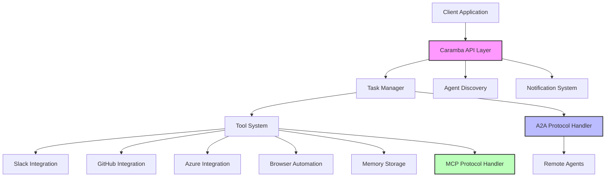

[](https://github.com/theapemachine/caramba/actions/workflows/main.yml)
[](https://goreportcard.com/report/github.com/theapemachine/caramba)
[](https://godoc.org/github.com/theapemachine/caramba)
[](https://opensource.org/licenses/MIT)
[](https://sonarcloud.io/summary/new_code?id=TheApeMachine_caramba)
[](https://sonarcloud.io/summary/new_code?id=TheApeMachine_caramba)
[](https://sonarcloud.io/summary/new_code?id=TheApeMachine_caramba)
[](https://sonarcloud.io/summary/new_code?id=TheApeMachine_caramba)
[](https://sonarcloud.io/summary/new_code?id=TheApeMachine_caramba)
[](https://sonarcloud.io/summary/new_code?id=TheApeMachine_caramba)
[](https://sonarcloud.io/summary/new_code?id=TheApeMachine_caramba)
[](https://sonarcloud.io/summary/new_code?id=TheApeMachine_caramba)
[](https://sonarcloud.io/summary/new_code?id=TheApeMachine_caramba)

# 🔮 Caramba: AI Agent Framework

Unleashing AI agent collaboration across ecosystems.

> Caramba is a cutting-edge platform that implements Google's Agent-to-Agent (A2A) protocol alongside Anthropic's Model Context Protocol (MCP), enabling seamless communication and collaboration between AI agents across different frameworks, vendors, and systems.

---

> **Warning**
> Caramba is currently in active development and certain parts of this documentation may be inaccurate or incomplete.

---

## 📑 Table of Contents

- [🔮 Caramba: AI Agent Framework](#-caramba-ai-agent-framework)
  - [📑 Table of Contents](#-table-of-contents)
  - [🚀 Core Features](#-core-features)
    - [🤖 Multi-Agent Orchestration](#-multi-agent-orchestration)
    - [🔧 Extensible Tool System](#-extensible-tool-system)
  - [🔐 Enterprise Security](#-enterprise-security)
  - [📊 Observability](#-observability)
  - [🔌 Protocol Integration](#-protocol-integration)
    - [A2A (Agent-to-Agent) Protocol](#a2a-agent-to-agent-protocol)
    - [MCP (Model Context Protocol)](#mcp-model-context-protocol)
    - [🔄 How A2A and MCP Work Together](#-how-a2a-and-mcp-work-together)
  - [🏗️ Architecture](#️-architecture)
  - [🛠️ Getting Started](#️-getting-started)
    - [The Easy Way](#the-easy-way)
    - [Prerequisites](#prerequisites)
    - [Installation](#installation)
    - [Configuration](#configuration)
  - [📖 Documentation](#-documentation)
    - [API Endpoints](#api-endpoints)
    - [Tool Development Guide](#tool-development-guide)
  - [🤝 Contributing](#-contributing)
  - [📄 License](#-license)

---

## 🚀 Core Features

### 🤖 Multi-Agent Orchestration

Caramba provides a comprehensive framework for multi-agent orchestration, including:

- Task-based workflow management
- Real-time streaming updates
- Event-driven architecture
- Push notification system

### 🔧 Extensible Tool System

Caramba's tool system is designed to be highly extensible, allowing you to add new tools and integrations as needed.

- Plugin architecture for tool integration
- Built-in adapters for popular services
- Custom tool development framework
- Tool discovery and registration

---

## 🔐 Enterprise Security

Caramba provides a secure and flexible authentication system, including:

- Authentication scheme flexibility
- Fine-grained authorization
- TLS/HTTPS with automatic cert management
- Secure credential handling

---

## 📊 Observability

Caramba provides comprehensive observability features, including:

- Comprehensive logging
- Performance metrics
- Task execution visibility
- Audit trail for agent interactions

---

## 🔌 Protocol Integration

Caramba uniquely bridges two powerful protocols to create a comprehensive agent orchestration platform:

### A2A (Agent-to-Agent) Protocol

Google's A2A protocol enables agents to communicate effectively regardless of their underlying implementation. Caramba implements:

- **Agent Card Discovery**: Standardized capability advertising through well-known endpoints
- **Task Management**: Complete lifecycle handling from creation to completion
- **Streaming Communication**: Real-time updates through SSE for ongoing tasks
- **Multi-Modal Support**: Exchange of various content types beyond just text
- **Push Notifications**: Alert mechanisms for state changes
- **Authentication Compatibility**: Support for multiple auth schemes

### MCP (Model Context Protocol)

Anthropic's MCP provides a standard interface for tools to interact with AI models. Caramba implements:

- **Tool Registration**: Seamless registration and discovery of available tools
- **Parameter Definition**: Structured specification of tool inputs/outputs
- **Context Management**: Maintaining state between tool executions
- **Error Handling**: Standardized way to surface and process errors
- **Type Safety**: Strong typing for tool interactions
- **Execution Control**: Coordinated invocation of tools across systems

As per the [A2A Protocol Post](https://google.github.io/A2A/#/topics/a2a_and_mcp), agents are implemented as MCP tools,
so "frameworks can then use A2A to communicate with their user, the remote agents, and other agents."

```go
// Example of MCP tool definition in Caramba
// From pkg/agent/tool.go
type InstructionTool struct {
    mcp.Tool
}

func NewInstructionTool() *InstructionTool {
    return &InstructionTool{}
}

func (tool *InstructionTool) Use(
    ctx context.Context, req mcp.CallToolRequest,
) (*mcp.CallToolResult, error) {
    // Tool implementation
    return mcp.NewToolResultText("Operation result"), nil
}
```

</details>

### 🔄 How A2A and MCP Work Together

Caramba creates a powerful synergy between A2A and MCP:

1. **A2A for Inter-Agent Communication**: Handles high-level coordination between agents
2. **MCP for Tool Execution**: Provides standardized interfaces for agents to use tools
3. **Seamless Data Flow**:
   - A2A tasks can trigger MCP tool executions
   - MCP tool results can be shared via A2A to other agents
4. **Unified Security Model**: Authentication and authorization spans both protocols
5. **Enhanced Capabilities**: Agents can discover and leverage each other's tools

> 💡 **Key Advantage**: While A2A enables agents to communicate tasks and collaborate, MCP provides the standardized tools framework that agents need to actually execute those tasks effectively. Together, they form a complete agent orchestration ecosystem.

---

## 🏗️ Architecture



Caramba's architecture is built around a modular design that maximizes flexibility and extensibility:

- **Core Service**: Built with Fiber for high-performance API handling
- **Protocol Handlers**: Dedicated modules for A2A and MCP specification compliance
- **Tool System**: Pluggable architecture for adding new capabilities
- **Event System**: Asynchronous message passing for real-time updates

---

## 🛠️ Getting Started

### The Easy Way

```bash
docker compose up
```

### Prerequisites

- Go 1.24+
- Access to services you want to integrate (Slack, GitHub, etc.)

### Installation

```bash
# Clone the repository
git clone https://github.com/theapemachine/caramba.git

# Change to project directory
cd caramba

# Build the project
go build -o caramba

# Run with configuration
./caramba --config=config.yaml
```

### Configuration

Create a `config.yaml` file with your settings:

```yaml
settings:
  domain: "your-domain.com"
  agent:
    name: "Your Agent Name"
    description: "Description of your agent's capabilities"
    version: "1.0.0"
    authentication:
      schemes: "bearer"
    defaultInputModes: ["text"]
    defaultOutputModes: ["text"]
    capabilities:
      streaming: true
      pushNotifications: true
    provider:
      organization: "Your Organization"
      url: "https://your-org.com"
```

---

## 📖 Documentation

### API Endpoints

- `GET /.well-known/ai-agent.json` - Returns the A2A Agent Card
- `POST /rpc` - JSON-RPC endpoint for A2A task operations
- `GET /task/:id/stream` - SSE endpoint for streaming task updates
- `GET /` - Health check endpoint

### Tool Development Guide

1. Create a new tool struct that embeds `mcp.Tool`
2. Implement the `Use` method to handle tool execution
3. Register the tool with the ToolWrapper in your application

Example:

```go
type MyTool struct {
    mcp.Tool
}

func NewMyTool() *MyTool {
    return &MyTool{
        Tool: mcp.NewTool(
            "my_tool",
            mcp.WithDescription("Description of my tool"),
            mcp.WithString(
                "param1",
                mcp.Description("Parameter description"),
                mcp.Required(),
            ),
        ),
    }
}

func (tool *MyTool) Use(
    ctx context.Context, req mcp.CallToolRequest,
) (*mcp.CallToolResult, error) {
    // Tool implementation
    return mcp.NewToolResultText("Result"), nil
}
```

For complete documentation, visit the [Wiki](https://github.com/theapemachine/caramba/wiki).

---

## 🤝 Contributing

Contributions are welcome! Please feel free to submit a Pull Request.

1. Fork the repository
2. Create your feature branch (`git checkout -b feature/amazing-feature`)
3. Commit your changes (`git commit -m 'Add amazing feature'`)
4. Push to the branch (`git push origin feature/amazing-feature`)
5. Open a Pull Request

---

## 📄 License

This project is licensed under the MIT License - see the LICENSE file for details.
