# Compute Backends

Caramba implements every backend from scratch. No backend falls back silently to a slower implementation—if a kernel isn't ported, the build fails. This is the core of the platform.

---

## Design Principles

**Explicit tensor ownership.** Tensors are resident in one backend and never implicitly transferred. Moving data between backends requires an explicit `DownloadFloat64` call at a real boundary.

**Typed hardware-agnostic IR.** The computation graph is expressed once as an IR (`pkg/backend/compute/ir`) with operation IDs, value types, canonical attributes, effects, aliasing, and verifier support. The same graph runs on CPU, CUDA, Metal, and XLA only after backend legality has been checked.

**No host staging.** Backend kernels keep tensors resident and only download when a real boundary is crossed (e.g., evaluation, checkpoint save). There is no per-operation round-trip to the host.

---

## Runner Interface

All backends implement the same interface:

```go
// pkg/backend/compute/runner/interface.go

type Runner interface {
    // Execute evaluates the graph for the specified output nodes.
    Execute(ctx context.Context, graph *ir.Graph, targets []*ir.Node) (map[string]tensor.Float64Tensor, error)

    // Location returns the hardware context string.
    Location() tensor.Location

    // Close releases hardware resources.
    Close() error
}
```

`Location` returns a string like `"cpu"`, `"cuda:0"`, `"metal"`, or `"xla:cpu"` that identifies where tensors computed by this runner reside.

---

## CPU Backend

**Package:** `pkg/backend/compute/cpu`

The CPU backend runs on every platform with no external dependencies. It is the reference implementation and the baseline for correctness.

### Pure Go

All operations have a pure Go implementation. No cgo required.

### SIMD / Assembly

Performance-critical kernels are implemented in platform-specific SIMD assembly alongside the Go fallback:

| Architecture | ISA extensions            | File suffix          |
|--------------|---------------------------|----------------------|
| x86-64       | AVX2, FMA, SSE2           | `_amd64.s`           |
| ARM64        | NEON, SVE                 | `_arm64.s`           |

The Go build system selects the correct assembly file automatically based on `GOARCH`. No build tags are required for SIMD—it is always compiled in on supported architectures.

Example: the Markov blanket kernel has dedicated ARM64 assembly:

```
pkg/backend/compute/cpu/operation/markov_blanket/
├── markov_blanket.go         # Go implementation + interface
├── markov_blanket_arm64.go   # ARM64 entrypoint (links asm)
└── markov_blanket_arm64.s    # NEON intrinsics
```

### Resident Tensor Backend

The CPU backend maintains tensors in-memory and exposes them through the `Float64Tensor` interface. Activation, math, and fused matmul+bias(+GELU) kernels operate directly on resident slices.

### Building

```bash
# Standard build (pure Go + SIMD where available)
go build ./pkg/backend/compute/cpu/...

# Tests
go test ./pkg/backend/compute/cpu/...
```

---

## CUDA Backend

**Package:** `pkg/backend/compute/cuda`

**Requirements:** Linux, NVIDIA CUDA toolkit, cgo enabled.

The CUDA backend exposes resident device tensors. All computation stays on-device.
Activation, math, shape, and fused linear kernels dispatch CUDA kernels directly.
Resident shape coverage includes reshape, transpose, concat, split,
nearest-neighbor upsample, view-as-heads, merge-heads, and last-token.

### Building

```bash
CGO_ENABLED=1 go build -tags "cgo cuda" ./pkg/backend/compute/cuda/...
CGO_ENABLED=1 go test  -tags "cgo cuda" ./pkg/backend/compute/cuda/...
```

The `cuda` build tag gates all cgo imports. Without it, the package compiles to stubs that return an unsupported-backend error at runtime.

---

## Metal Backend

**Package:** `pkg/backend/compute/metal`

**Requirements:** macOS, Xcode Command Line Tools (Metal-capable GPU).

The Metal backend exposes resident `MTLBuffer` tensors. Compute pipelines are compiled from Metal Shading Language sources embedded in the package.

### Shape Slice

`operation_executor.applySlice` dispatches Metal `shape.slice` through
`SlicePrefixTensor`, so Metal currently requires `start==0` and leading-dim
slicing. Unsupported manifests fail with this error:

```text
metal tensor: slice node %q currently supports start=0 with leading-dim slicing only (got start=%d, dim=%d, outer=%d)
```

Supported on Metal:

```yaml
op: shape.slice
config: { dim: 1, start: 0, end: 4096 } # shape [1, 4112, 64], outer=1
```

Unsupported on Metal:

```yaml
op: shape.slice
config: { dim: 1, start: 64, end: 128 } # start != 0
```

Run non-prefix slices on CPU or avoid them until Metal strided-copy support is
implemented.

### Precision Contract

Metal currently stores and executes tensor values as `float32`, then exposes them through the shared `Float64Tensor` API at host boundaries. This is an explicit backend contract, not a claim of `float64` arithmetic.

The orchestrator treats IR nodes as requiring `float64` precision by default. Because Metal advertises `float32` precision for its operation families, lowering to Metal is rejected unless the manifest or IR node explicitly opts into `float32` precision:

```yaml
config:
  precision: float32
```

This prevents silent precision degradation. CPU, CUDA, and XLA remain `float64` routes unless their capability contracts declare otherwise. A future double-single Metal path can be added as a separate `float64`-equivalent capability without changing the default safety rule.

### Building

```bash
# No separate "metal" tag—Darwin + CGO selects the Metal implementation
CGO_ENABLED=1 go build ./pkg/backend/compute/metal/...
CGO_ENABLED=1 go test  ./pkg/backend/compute/metal/...
```

The build constraint is `//go:build darwin && cgo`. On non-Darwin platforms, the package compiles to stubs.

---

## XLA Backend (PJRT)

**Package:** `pkg/backend/compute/xla`

**Requirements:** XLA headers and a PJRT plugin library (CPU or GPU).

XLA is accessed through the PJRT C API. The backend exposes resident PJRT buffers
for activation, elementwise math, matmul, shape transforms, and fused
matmul+bias(+GELU). Shape transforms are lowered to StableHLO reshape,
transpose, concatenate, broadcast, and slice operations.

### Configuration

PJRT paths are loaded through `pkg/config` from `cmd/asset/config.yml`:

```yaml
compute:
  xla:
    include_dir: /path/to/xla/include
    cpu_plugin_file: /path/to/pjrt_c_api_cpu_plugin.so
    gpu_plugin_file: /path/to/pjrt_c_api_gpu_plugin.so
    tpu_plugin_file: ""
    shared_plugin_file: ""
    library_dirs:
      - /path/to/pjrt/plugins
```

Plugin lookup order:
1. `compute.xla.<platform>_plugin_file`
2. `compute.xla.shared_plugin_file`
3. `compute.xla.library_dirs` searched for platform plugin names

### Building

```bash
CGO_ENABLED=1 go build -tags "cgo xla" ./pkg/backend/compute/xla/...
CGO_ENABLED=1 go test  -tags "cgo xla" ./pkg/backend/compute/xla/...
```

---

## Compiler Pipeline

Before a graph reaches a runner, it passes through the compiler pipeline in `pkg/backend/compute/orchestrator`:

```mermaid
flowchart LR
  verifier["Verifier"] --> canonicalizer["Canonicalization"]
  canonicalizer --> cse["Semantic CSE"]
  cse --> algebra["Algebraic Simplification"]
  algebra --> fusion["Backend-Legal Fusion"]
  fusion --> dce["Side-Effect-Aware DCE"]
  dce --> memory["Memory Planner"]
  memory --> schedule["Cost Scheduler"]
  schedule --> lowering["Backend Lowering"]
```



### Verifier

Rejects malformed graphs before execution: missing inputs, duplicate nodes, cycles, invalid targets, and backend lowering errors.

### Semantic CSE

Identifies pure nodes with identical operation IDs, typed value semantics, canonical attributes, and canonicalized inputs. Effectful, random, checkpoint, and state-writing nodes are never merged.

### Algebraic Simplification

Runs after canonicalization so identity folds and future view/reshape simplifications operate on stable attributes instead of opaque metadata.

### Backend-Legal Fusion

Merges adjacent compatible operations only when the selected backend declares the fused form legal. The primary fusion family is matmul plus activation or bias and activation, which eliminates intermediate tensor allocations and improves cache locality.

```
BEFORE fusion:          AFTER fusion:
MatMul                  FusedLinearGELU
  └─▶ BiasAdd     ═══▶  (single kernel)
        └─▶ GELU
```

### Side-Effect-Aware DCE

Removes unreachable pure nodes while preserving ordered side effects such as checkpoints, external IO, state reads/writes, and model registry mutations.

### Memory Planner

Computes tensor lifetimes, buffer assignments, and reuse candidates. Buffer reuse only happens when lifetimes do not overlap and aliasing semantics permit it.

### Cost Scheduler

Annotates graph nodes with cost and schedule metadata using backend capabilities. The lowering pass then rejects unsupported operations instead of silently staging work through another backend.

### Manifest and Network IR

Manifest graphs lower into typed IR while preserving manifest IDs, port bindings, operation IDs, and typed config attributes. Network execution now carries versioned operation IDs and attributes in node config payloads so remote workers receive compiler semantics instead of ad hoc activation strings.

---

## Tensor Abstraction

```go
// pkg/backend/compute/tensor/tensor.go

type Float64Tensor interface {
    Shape() []int
    DownloadFloat64() ([]float64, error)
    Location() Location
}

type Location string

const (
    LocationCPU    Location = "cpu"
    LocationCUDA   Location = "cuda:0"
    LocationMetal  Location = "metal"
    LocationXLACPU Location = "xla:cpu"
    LocationXLAGPU Location = "xla:gpu"
)
```

Tensors are never implicitly copied. `DownloadFloat64` is the only escape hatch, and it is intentionally named to make the cost visible at the call site.

---

## Adding a New Backend

1. Create a package under `pkg/backend/compute/<name>/`
2. Implement the `runner.Runner` interface
3. Implement `Float64Tensor` for the backend's native tensor type
4. Add build constraints (`//go:build <tag>`) that gate cgo imports
5. Add a `runner_test.go` that runs the full IR test suite against your runner
6. Add build instructions to this document
